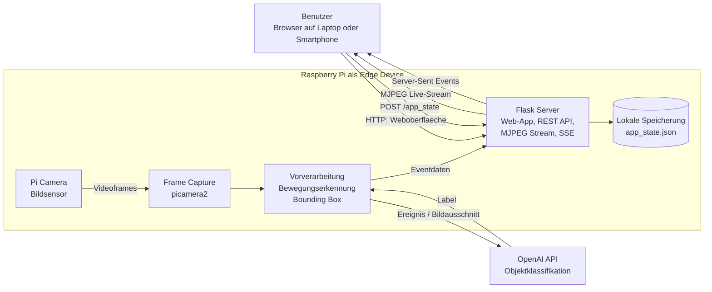
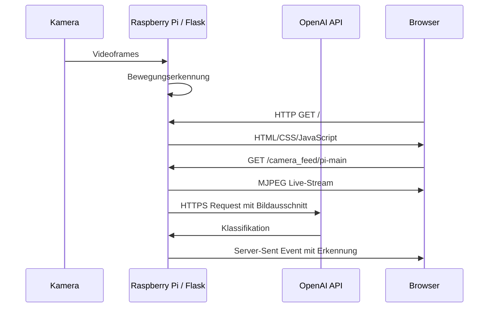

# RaspCamIoT - IoT-Lab-Ausarbeitung

**Projekt:** RaspCamIoT - Kameraueberwachung mit Bewegungserkennung  
**Kurs:** TINF24F / TINF24A  
**Gruppe:** Namen und Matrikelnummern hier eintragen  
**Abgabe:** IoT Praxis Seminararbeit, SS 2026  

> Umfangsziel: Diese Ausarbeitung ist fuer maximal 8 PDF-Seiten ausgelegt. Die Diagramme sollten beim Export nicht zu gross skaliert werden.

---

## 1. Anwendungsfall der IoT-Loesung

RaspCamIoT adressiert den Anwendungsfall einer einfachen, kostenguenstigen Kameraueberwachung fuer Innenraeume, Eingangsbereiche oder Laborumgebungen. Ein Raspberry Pi mit Kamera nimmt fortlaufend Bilddaten auf und stellt sie in einer lokalen Weboberflaeche bereit. Gleichzeitig erkennt die Anwendung Bewegungen im Kamerabild und kann Ereignisse protokollieren.

Das Ziel ist nicht die permanente Speicherung eines Videostreams, sondern die gezielte Erkennung und Anzeige relevanter Ereignisse. Dadurch wird die Loesung ressourcenschonender als eine klassische Daueraufzeichnung. Die Benutzeroberflaeche zeigt den Live-Stream, den aktuellen Erkennungsstatus, einfache Einstellungen und eine Ereignishistorie.

Optional kann ein externer Cloud-Dienst zur Klassifikation genutzt werden. In der aktuellen Umsetzung wird ein erkannter Bildausschnitt an die OpenAI API gesendet, um ein Ereignis grob einzuordnen, zum Beispiel als Mensch, Tier oder Bewegung.

---

## 2. Architektur-Uebersichtsdiagramm

Die Architektur folgt einem Edge-Ansatz: Die Kamera und die erste Verarbeitung laufen direkt auf dem Raspberry Pi. Dadurch muessen nicht alle Rohdaten permanent an einen externen Server gesendet werden. Nur bei relevanten Ereignissen wird ein Bildausschnitt fuer die Klassifikation an die Cloud-API uebertragen.

---

## 3. IoT Value Stack

| IoT-Layer | Umsetzung in RaspCamIoT |
|---|---|
| Device Layer | Raspberry Pi als Recheneinheit |
| Sensor Layer | Pi Camera als Bildsensor |
| Edge / Function Layer | Aufnahme von Frames, Bewegungserkennung, Bounding Box, Auswahl eines relevanten Bildausschnitts |
| Communication Layer | HTTP fuer Weboberflaeche und Einstellungen, MJPEG fuer Livebild, Server-Sent Events fuer Ereignisse, HTTPS zur OpenAI API |
| Data Layer | Lokale Speicherung in `Backend/app_state.json` mit Einstellungen, letzter Erkennung und Ereignishistorie |
| Application Layer | Browser-Frontend mit Livebild, Steuerung, Zeitfenster, Ereigniszaehlern und Verlauf |
| Cloud / Analytics Layer | OpenAI API zur Klassifikation erkannter Bildausschnitte |

Die Loesung deckt damit die wesentlichen Schichten einer IoT-Anwendung ab: physische Datenerfassung, lokale Verarbeitung, Datenuebertragung, Speicherung, Auswertung und Visualisierung.

---

## 4. Datenerfassung mit Sensor

Die Sensordaten werden durch die Raspberry-Pi-Kamera erfasst. Die Kamera liefert kontinuierlich Videoframes mit einer Aufloesung von 640 x 480 Pixeln. Auf dem Raspberry Pi wird die Kamera ueber `picamera2` angesprochen. Fuer die lokale Entwicklung ohne echte Kamera gibt es einen Demo-Modus, der einen kuenstlichen Stream erzeugt.

Die Kamera ist in dieser Loesung der zentrale Sensor. Statt einzelner numerischer Messwerte wie Temperatur oder Luftfeuchtigkeit entstehen Bilddaten. Diese sind unstrukturierte Sensordaten und benoetigen deshalb eine Vorverarbeitung, bevor daraus ein kompaktes IoT-Ereignis entsteht.

---

## 5. Datenvorverarbeitung und Sourcecode

Die Vorverarbeitung findet direkt auf dem Raspberry Pi statt. Das Backend liest Frames aus dem Kamerastream und vergleicht aufeinanderfolgende Bilder. Dabei wird das Bild in Graustufen umgewandelt, geglaettet und anschliessend die Differenz zwischen zwei Frames berechnet. Wenn sich ein ausreichend grosser Bereich veraendert, wird eine Bounding Box um die Bewegung erzeugt.

Vereinfacht besteht die Logik aus folgenden Schritten:

1. Kameraframe erfassen
2. Bild in Graustufen umwandeln
3. aktuelles Frame mit vorherigem Frame vergleichen
4. Konturen groesser als Schwellwert erkennen
5. Bounding Box berechnen
6. relevanten Bildausschnitt fuer die Klassifikation vorbereiten
7. Ereignis mit Label und Zeitstempel speichern

Diese Vorverarbeitung reduziert die Datenmenge. Es wird nicht dauerhaft das komplette Video ausgewertet oder uebertragen, sondern nur bei erkannter Bewegung ein relevanter Ausschnitt weiterverarbeitet.

---

## 6. Datenuebertragung

Die Kommunikation innerhalb der lokalen Anwendung erfolgt ueber HTTP. Der Browser ruft die Weboberflaeche vom Flask-Server ab. Der Live-Stream wird als MJPEG-Stream ueber den Endpunkt `/camera_feed/pi-main` bereitgestellt. Einstellungen wie Spiegelung, Anzeigeoptionen oder Zeitfenster werden ueber `/app_state` gesendet.

Ereignisse werden per Server-Sent Events an den Browser uebertragen. Dadurch kann die Weboberflaeche neue Erkennungen anzeigen, ohne staendig aktiv abzufragen. Die Kommunikation zur OpenAI API erfolgt per HTTPS und nur fuer einen relevanten Bildausschnitt.

---

## 7. Serveranwendung und Speicherung

Die Serveranwendung ist mit Flask umgesetzt und laeuft direkt auf dem Raspberry Pi. Sie uebernimmt mehrere Aufgaben:

- Ausliefern der Weboberflaeche
- Bereitstellen des Kamera-Livestreams
- Verwalten der Einstellungen
- Auswerten erkannter Bewegungen
- Speichern von Ereignissen
- Weiterleiten aktueller Ereignisse an den Browser

Die lokale Speicherung erfolgt in `Backend/app_state.json`. Dort werden Einstellungen, der letzte erkannte Zustand und die Ereignishistorie gespeichert. Fuer ein kleines IoT-Lab ist diese dateibasierte Speicherung ausreichend, weil keine grosse Datenmenge oder parallele Mehrbenutzer-Datenbank benoetigt wird.

Die Weboberflaeche zeigt den aktuellen Stream, den Erkennungsstatus, Zaehler fuer Ereignisse und eine Historie der letzten Erkennungen. Damit ist die Serveranwendung nicht nur Empfaenger der Daten, sondern auch Auswertungs- und Visualisierungskomponente.

---

## 8. Aktuator / Reaktion und Fazit

Ein physischer Aktuator ist in der aktuellen Version nicht zwingend Bestandteil der Loesung. Die Anwendung besitzt jedoch eine softwarebasierte Reaktion auf erkannte Ereignisse: Im Frontend werden Ereignisse angezeigt, Alarme hervorgehoben und ein Alarmton kann im Browser abgespielt werden. Diese Reaktion entspricht einem digitalen Aktuator auf Anwendungsebene.

Eine moegliche Erweiterung waere ein physischer Buzzer, eine LED oder ein Relais am Raspberry Pi. Diese koennten bei einer Mensch-Erkennung im aktiven Zeitfenster geschaltet werden. Dadurch wuerde die Loesung eine direkte physische Aktuatorsteuerung erhalten.

Zusammenfassend zeigt RaspCamIoT eine vollstaendige kleine IoT-Loesung: Ein Sensor erfasst Daten, ein Edge Device verarbeitet sie lokal, relevante Ereignisse werden uebertragen, gespeichert, klassifiziert und in einer Webanwendung angezeigt. Die Architektur ist bewusst einfach gehalten und eignet sich fuer eine Demonstration im Rahmen des IoT-Labs.
